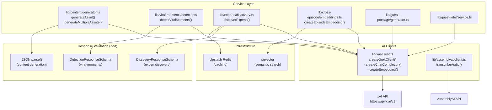

# Layer Report: AI Layer

**Agent:** ai-layer
**Date:** 2026-02-24
**Project:** PodBrain

---

## Summary

PodBrain integrates AI at multiple levels: AssemblyAI for transcription, xAI Grok for content generation and embeddings, and pgvector for semantic similarity search. The AI architecture is well-designed with clear separation between model clients and business logic. Prompt management is partially centralized — show notes and most asset types use a structured `ASSET_PROMPTS` registry, but viral moments and expert discovery have their own inline prompts. AI response validation using Zod schemas is present in critical paths (viral moments, expert discovery). The primary concern is the current model identifier `grok-beta` — this is a non-stable API identifier that may change without notice.

---

## AI Service Inventory

| Service | Provider | Purpose | Client Location |
|---------|----------|---------|-----------------|
| Transcription | AssemblyAI | Audio → text with speaker diarization | `lib/assemblyai/client.ts` |
| Content generation | xAI Grok (`grok-beta`) | 30+ asset types from transcript | `lib/content/generator.ts`, `lib/xai-client.ts` |
| Embeddings | xAI Grok (`grok-embedding-small`) | Vocabulary + episode section vectors (1536d) | `lib/xai-client.ts` |
| Viral moment detection | xAI Grok (`grok-beta`) | Identify shareable clips | `lib/viral-moments/detector.ts` |
| Expert discovery | xAI Grok (`grok-beta`) | Podcast guest recommendations | `lib/experts/discovery.ts` |
| Semantic search | pgvector (PostgreSQL) | Cross-episode content similarity | `lib/cross-episode/similarity.ts` |
| SEO analysis | Pure TypeScript | Keyword density + readability scoring | `lib/seo/analyzer.ts` |

---

## Prompt Management Architecture

### Centralized: Asset Prompts Registry

`lib/content/asset-prompts.ts` defines `ASSET_PROMPTS: Record<AssetType, AssetPromptConfig>` covering 30+ asset types. Each entry specifies:
- `systemPrompt` — role and output format instructions
- `userPrompt(context: AssetContext)` — dynamic prompt function with transcript injection
- `maxTokens` — per-asset token budget
- `temperature` — per-asset creativity setting

All asset prompts share a `COMMON_SYSTEM_PROMPT` that instructs JSON response format. The transcript is injected via `ctx.transcript.slice(0, 8000)` — a hard-coded truncation at 8000 characters, which may lose content for long episodes.

### Distributed: Feature-Specific Prompts

| Location | Prompt Style | Notes |
|----------|-------------|-------|
| `lib/viral-moments/detector.ts` | Inline multi-line string | Well-structured; includes scoring algorithm in prompt |
| `lib/experts/discovery.ts` | Inline multi-line string | Includes freshness calculation criteria |
| `lib/guest-package/generator.ts` | Unknown (not read) | Likely inline |
| `lib/seo/schema-generator.ts` | No AI prompt (rule-based) | Pure TypeScript, no LLM |

---

## AI Client Architecture

---

## Error Handling at AI Boundaries

| Service | Retry Logic | Timeout | Error Propagation |
|---------|------------|---------|-------------------|
| `lib/content/generator.ts` | 3 attempts with exponential backoff (1s, 2s, 4s) | No explicit timeout | Returns `{ success: false, error }` |
| `lib/xai-client.ts` | None (single fetch) | No explicit timeout | Throws Error |
| `lib/assemblyai/client.ts` | SDK handles internally | SDK handles internally | Re-throws Error |
| `lib/viral-moments/detector.ts` | None | No explicit timeout | Throws Error |
| `lib/experts/discovery.ts` | None | No explicit timeout | Throws Error |
| Trigger.dev jobs | 3 attempts, exponential backoff | 30 min max job duration | Job status = failed |

---

## AI Response Validation

### Critical Path — Viral Moments (Excellent)

`lib/viral-moments/detector.ts` uses comprehensive Zod validation:
- `ViralMomentSchema` validates structure, types, ranges, and string patterns
- HTML entity encoding applied to quote and reasoning strings (XSS prevention)
- Max AI response size check (500,000 characters)
- Transcript normalization (`NFC`) before sending to AI

### Critical Path — Expert Discovery (Good)

`lib/experts/discovery.ts` uses Zod validation:
- `ExpertSchema` validates URL patterns and Twitter handle format
- Post-validation URL filtering (double-checks regex)
- Max AI response size check (500,000 characters)

### Other Paths — Asset Generation (Minimal)

`lib/content/generator.ts` only calls `JSON.parse(content)` — no schema validation. Malformed or adversarial AI responses could produce unexpected content stored in the database.

---

## Prompt Injection Risk Assessment

| Path | User Input in Prompt | Sanitization | Risk |
|------|---------------------|-------------|------|
| Asset generation | `ctx.transcript` (from AssemblyAI), `ctx.guestName`, `ctx.guestBio` | None | Medium — user-controlled guestName/guestBio injected into prompts |
| Viral moments | `normalizedTranscript` | Unicode NFC normalization | Low — transcript is audio-derived, not direct user input |
| Expert discovery | `topic` parameter | None | Medium — user-typed topic injected into system prompt |
| Guest package | Unknown | Unknown | Unknown |

---

## Embedding Architecture

**Vocabulary embeddings** (`vocabulary_terms.embedding`):
- dimension: 1536 (xAI `grok-embedding-small`)
- HNSW index with `vector_cosine_ops`
- Used for fuzzy vocabulary matching across transcript corrections

**Episode section embeddings** (`episode_sections.embedding`):
- dimension: 1536
- HNSW index with `vector_cosine_ops`
- Used for cross-episode semantic similarity search
- The `lib/cross-episode/` module performs similarity queries

**Dimension mismatch risk:** Both use 1536-dimensional vectors assuming `grok-embedding-small`. If the model is changed (e.g., to `grok-embedding-large`), existing vectors would be dimensionally incompatible with new vectors. No migration strategy is in place.

---

## AI Cost Budget Analysis

From `lib/constants.ts` and `lib/content/generator.ts`:
- Target cost per episode: `$0.15`
- Estimated pricing: `$0.002/1K input tokens`, `$0.006/1K output tokens`
- `estimateGenerationCost()` function exists but is not called pre-generation (no cost guard)

For a 4-hour audio file with 30+ assets generated in parallel, the actual cost could significantly exceed $0.15 with no enforcement mechanism.

---

## Findings

**FINDING [HIGH] — Using `grok-beta` model identifier — not a stable API reference**
Both `lib/xai-client.ts` (DEFAULT_MODEL = `'grok-beta'`) and `lib/content/generator.ts` (DEFAULT_MODEL = `'grok-beta'`) use the beta model identifier. Beta models can be deprecated, renamed, or changed by xAI without notice, potentially breaking all content generation silently. A stable versioned model ID (e.g., `grok-2-1212`) should be used.

**FINDING [HIGH] — No AI cost guard — cost estimation function exists but is never called**
`estimateGenerationCost()` in `generator.ts` calculates expected API costs but is never invoked before generating assets. Multiple asset types are generated in `Promise.all()`, meaning all API calls are concurrent. For a 30-asset batch from a long transcript, costs could significantly exceed the `$0.15` target with no warning or circuit breaker.

**FINDING [HIGH] — Asset generation uses JSON.parse without schema validation**
`lib/content/generator.ts` calls `JSON.parse(content)` on the xAI response but does not validate the parsed structure. If Grok returns unexpected fields, missing fields, or malicious content in JSON form, it is stored directly to the database. Zod validation (like that used in viral-moments) should be applied to all asset types.

**FINDING [MEDIUM] — Transcript truncated to 8000 characters in asset prompts**
`asset-prompts.ts` injects `ctx.transcript.slice(0, 8000)` into prompts. An average 4-hour podcast transcript is ~150,000+ characters. This means approximately 95%+ of the transcript is discarded during asset generation. The resulting show notes would only reflect the first few minutes of the episode.

**FINDING [MEDIUM] — User input (guestName, guestBio, topic) injected into prompts without sanitization**
`upload-wizard.tsx` collects `guestName` and `guestBio` from users and passes them into xAI prompts via `AssetContext`. The `topic` field in expert discovery is also user-typed and directly injected. No sanitization prevents prompt injection attempts (e.g., "Ignore previous instructions and...").

**FINDING [MEDIUM] — No timeout on direct xAI API calls outside Trigger.dev**
`lib/xai-client.ts` calls `fetch()` without a timeout. Route handlers that call xAI directly (e.g., `/api/episodes/[id]/seo`, `/api/episodes/[id]/viral-moments`) could hang indefinitely on an xAI API slowdown, consuming the 30-second Next.js serverless function limit.

**FINDING [LOW] — Embedding dimension not validated on storage**
Before inserting embeddings from `createEmbedding()` into Supabase, there is no check that the returned vector has exactly 1536 dimensions. If the model is changed or the API returns a different embedding, silent data corruption could occur.

**FINDING [INFO] — Viral moments detector has excellent security practices**
HTML entity encoding on AI-returned quote/reasoning strings, Zod schema validation, max response size limits, and Unicode normalization. This should be the pattern for all AI response handling.

---

## Findings Summary

| Severity | Count | Items |
|----------|-------|-------|
| Critical | 0 | — |
| High | 3 | Unstable grok-beta model ID, No cost guard, No Zod validation on assets |
| Medium | 3 | Transcript truncation to 8000 chars, Prompt injection via user fields, No fetch timeout |
| Low | 1 | Embedding dimension not validated |
| Info | 1 | Viral moments has excellent security practices |
