# Layer Report: API Surface

**Agent:** api-surface
**Date:** 2026-02-24
**Project:** PodBrain

---

## Summary

PodBrain exposes 26 Next.js Route Handler endpoints across 14 resource groups. All routes follow RESTful conventions under `/api/`. The API uses a consistent `{ data, error }` response envelope with typed wrappers (`ApiResponse<T>`, `PaginatedResponse<T>`). Authentication is bypassed in single-user mode — all routes use the hardcoded `DEFAULT_USER_ID` constant. Rate limiting exists as a utility but is not applied to any API routes. Stripe webhook signature validation is correctly implemented. Three debug/test routes are present and use a `devGuard()` mechanism for production protection.

---

## Complete Route Inventory

### Episode Routes

| Method | Path | Handler | Auth | Notes |
|--------|------|---------|------|-------|
| GET | `/api/episodes` | `episodes/route.ts` | None (DEFAULT_USER_ID) | List episodes; supports show_id, status, page, per_page filters |
| POST | `/api/episodes` | `episodes/route.ts` | None | Create episode — NOT FOUND in route listing (GET only in episodes/route.ts) |
| GET | `/api/episodes/[id]` | `episodes/[id]/route.ts` | None | Get single episode with full data |
| PUT | `/api/episodes/[id]` | `episodes/[id]/route.ts` | None | Update episode fields |
| DELETE | `/api/episodes/[id]` | `episodes/[id]/route.ts` | None | Delete episode |
| POST | `/api/episodes/[id]/process` | `process/route.ts` | None | Trigger processing pipeline |
| GET | `/api/episodes/[id]/process` | `process/route.ts` | None | Get processing run status |
| DELETE | `/api/episodes/[id]/process` | `process/route.ts` | None | Cancel processing run |
| PUT | `/api/episodes/[id]/process` | `process/route.ts` | None | Replay failed run |
| GET | `/api/episodes/[id]/assets` | `assets/route.ts` | None | List generated assets |
| POST | `/api/episodes/[id]/assets` | `assets/route.ts` | None | Trigger asset generation |
| GET | `/api/episodes/[id]/assets/download` | `assets/download/route.ts` | None | Download assets as ZIP |
| GET | `/api/episodes/[id]/seo` | `seo/route.ts` | None | Get SEO analysis |
| POST | `/api/episodes/[id]/seo` | `seo/route.ts` | None | Run/refresh SEO analysis |
| GET | `/api/episodes/[id]/guest-package` | `guest-package/route.ts` | None | Get guest promo package |
| POST | `/api/episodes/[id]/guest-package` | `guest-package/route.ts` | None | Generate guest promo package |
| GET | `/api/episodes/[id]/guest-package/download` | `guest-package/download/route.ts` | None | Download guest package |
| GET | `/api/episodes/[id]/guest-intel` | `guest-intel/route.ts` | None | Get AI guest intelligence |
| GET | `/api/episodes/[id]/related` | `related/route.ts` | None | Get related episodes (vector search) |
| GET | `/api/episodes/[id]/viral-moments` | `viral-moments/route.ts` | None | Get/detect viral moments |

### Show Routes

| Method | Path | Handler | Auth | Notes |
|--------|------|---------|------|-------|
| GET | `/api/shows` | `shows/route.ts` | None | List shows for DEFAULT_USER_ID; paginated |
| POST | `/api/shows` | `shows/route.ts` | None | Create show |
| GET | `/api/shows/[id]/experts` | `shows/[id]/experts/route.ts` | None | AI expert discovery for show |
| GET | `/api/shows/[id]/related-episodes` | `shows/[id]/related-episodes/route.ts` | None | Cross-episode similarity search |

### Upload

| Method | Path | Handler | Auth | Notes |
|--------|------|---------|------|-------|
| POST | `/api/upload` | `upload/route.ts` | None | Upload audio file to Supabase Storage; returns signed URL (24h) |

### Buzzsprout Integration

| Method | Path | Handler | Auth | Notes |
|--------|------|---------|------|-------|
| POST | `/api/buzzsprout/connect` | `buzzsprout/connect/route.ts` | None | Connect Buzzsprout account (API token) |
| DELETE | `/api/buzzsprout/connect` | `buzzsprout/connect/route.ts` | None | Disconnect Buzzsprout |
| GET | `/api/buzzsprout/podcasts` | `buzzsprout/podcasts/route.ts` | None | List Buzzsprout podcasts |
| GET | `/api/buzzsprout/episodes` | `buzzsprout/episodes/route.ts` | None | List Buzzsprout episodes |
| POST | `/api/buzzsprout/push-notes` | `buzzsprout/push-notes/route.ts` | None | Push show notes to Buzzsprout |

### Stripe

| Method | Path | Handler | Auth | Notes |
|--------|------|---------|------|-------|
| POST | `/api/stripe/checkout` | `stripe/checkout/route.ts` | None | Create Stripe checkout session |
| POST | `/api/stripe/portal` | `stripe/portal/route.ts` | None | Create Stripe billing portal session |
| POST | `/api/stripe/webhooks` | `stripe/webhooks/route.ts` | Signature validation | Handles checkout.session.completed, subscription.updated/deleted |

### Subscriptions

| Method | Path | Handler | Auth | Notes |
|--------|------|---------|------|-------|
| GET | `/api/subscriptions` | `subscriptions/route.ts` | None | Get current subscription state |

### Debug/Test Routes (Dev Only)

| Method | Path | Handler | Dev-only Guard | Notes |
|--------|------|---------|----------------|-------|
| GET | `/api/seed` | `seed/route.ts` | devGuard() | Seed test data |
| GET/POST | `/api/test-db` | `test-db/route.ts` | devGuard() | Test database connectivity |
| GET | `/api/test-redis` | `test-redis/route.ts` | devGuard() | Test Redis connectivity |
| POST | `/api/test-guest-package` | `test-guest-package/route.ts` | devGuard() | Test guest package generation |

---

## Middleware Chain Analysis

**No global middleware.ts exists.** There is no Next.js middleware file. This means:
- No centralized authentication enforcement
- No global CORS header injection
- No global rate limiting
- No request logging at the edge

Each route implements its own patterns independently. Common patterns observed per-route:
1. Parse URL/body parameters
2. Call `createClient()` to get Supabase connection
3. Apply `DEFAULT_USER_ID` filter
4. Return `{ data, error }` JSON response

**Rate limiting:** `lib/redis/rate-limit.ts` and `lib/rate-limit.ts` both exist with rate-limiting implementations. However, inspection of route handlers shows rate limiting is **not applied** to any endpoint. The constants define limits (60 req/min default, 10 req/min processing, 30 req/min asset generation) but these are currently unused.

**Validation:** `lib/validation.ts` provides `validateUUID`, `validateEmail`, `sanitizeString`, and `validatePagination`. Usage is inconsistent — some routes validate UUID params, others do not.

---

## Response Format

All routes consistently use:
```typescript
{ data: T | null, error: string | null }          // ApiResponse<T>
{ data: T[], total: number, page: number, per_page: number }  // PaginatedResponse<T>
```

This is consistent and well-typed. Error responses include appropriate HTTP status codes (400, 401, 404, 409, 413, 500).

---

## Mermaid API Flow Diagram

```mermaid
flowchart LR
    Client["Browser Client"]

    subgraph ShowAPIs["Show APIs"]
        S1["GET /api/shows"]
        S2["POST /api/shows"]
        S3["GET /api/shows/:id/experts"]
        S4["GET /api/shows/:id/related-episodes"]
    end

    subgraph EpisodeAPIs["Episode APIs"]
        E1["GET/POST /api/episodes"]
        E2["GET/PUT/DELETE /api/episodes/:id"]
        E3["POST /api/episodes/:id/process"]
        E4["GET /api/episodes/:id/assets"]
        E5["GET /api/episodes/:id/seo"]
        E6["GET /api/episodes/:id/guest-package"]
        E7["GET /api/episodes/:id/viral-moments"]
        E8["GET /api/episodes/:id/related"]
    end

    subgraph Integration["Integration APIs"]
        B1["POST /api/buzzsprout/connect"]
        B2["POST /api/buzzsprout/push-notes"]
        P1["POST /api/stripe/checkout"]
        P2["POST /api/stripe/webhooks"]
        U1["POST /api/upload"]
    end

    subgraph Backend["Backend Services"]
        Supabase["Supabase DB"]
        TriggerDev["Trigger.dev v4\n(background jobs)"]
        Grok["xAI Grok"]
        Storage["Supabase Storage"]
        StripeAPI["Stripe API"]
        BuzzsproutAPI["Buzzsprout API"]
    end

    Client --> ShowAPIs
    Client --> EpisodeAPIs
    Client --> Integration

    ShowAPIs --> Supabase
    EpisodeAPIs --> Supabase
    E3 --> TriggerDev
    E4 --> Grok
    E5 --> Grok
    E6 --> Grok
    U1 --> Storage
    B1 --> BuzzsproutAPI
    B2 --> BuzzsproutAPI
    P1 --> StripeAPI
    P2 --> StripeAPI
```



---

## Findings

**FINDING [CRITICAL] — No rate limiting applied to any endpoint despite rate-limit implementation existing**
`lib/redis/rate-limit.ts` and `lib/rate-limit.ts` both implement rate limiting. `constants.ts` defines rate limits for default (60/min), processing (10/min), and asset generation (30/min). However, none of the 26 route handlers call these functions. The expensive endpoints (episode processing, asset generation) can be called unlimited times, potentially causing runaway costs from AI API calls.

**FINDING [HIGH] — No authentication on any API route (by design but undocumented at route level)**
Every route uses `DEFAULT_USER_ID` without any authentication check. While this is intentional for MVP, there is no `// TODO: replace with auth.uid()` comment or `validateAuth()` call in most routes. The `validateAuth()` function in `lib/auth.ts` exists but is unused. Without a middleware forcing auth on all routes pre-launch, individual routes could be missed during the auth migration.

**FINDING [HIGH] — UUID validation not consistently applied to path parameters**
`/api/episodes/[id]` passes the `id` path parameter directly to Supabase queries without UUID format validation. A malformed UUID (e.g. `../admin`) would result in a Supabase error rather than a proper 400 validation response. `lib/validation.ts` provides `validateUUID()` but it's not used in episode route handlers.

**FINDING [MEDIUM] — POST /api/episodes endpoint appears missing from route file**
`GET /api/episodes` exists for listing. However, the standard `POST /api/episodes` (create episode) may be handled differently — the upload flow creates episodes via a different mechanism. This creates an inconsistent REST pattern where episodes are created outside the standard resource route.

**FINDING [MEDIUM] — devGuard() relies on NODE_ENV — could be bypassed**
`devGuard()` returns 404 only when `process.env.NODE_ENV === 'production'`. If someone deploys with `NODE_ENV=development` or `NODE_ENV=test` in a non-dev environment, seed and test routes would be accessible. A more explicit `ENABLE_DEV_ROUTES=false` flag would be safer.

**FINDING [MEDIUM] — Upload route returns both a signed URL (24h) and a public URL**
`/api/upload` generates a signed URL (24h validity) for AssemblyAI to fetch the audio file, but also returns `publicUrl` for permanent access. Signed URLs expire after 24h — if processing takes longer (unlikely but possible), AssemblyAI would fail to fetch the audio. The audio processing max is 30 min (Trigger.dev `maxDuration`), so this is low risk but the 24h window is the minimum that makes it work.

**FINDING [LOW] — Inconsistent error response shapes between some routes**
Most routes use `{ data: null, error: string }`. A few simpler routes (e.g., `buzzsprout/connect`) return `{ error: string }` without the `data` field. This inconsistency could cause client-side type errors if the typed `ApiResponse<T>` wrapper is assumed everywhere.

**FINDING [LOW] — No CORS headers configured**
No CORS headers are set anywhere. If the API is ever accessed from a different origin (e.g., mobile app, partner integration), requests will be blocked. Currently not a problem in single-origin deployment, but worth noting.

**FINDING [INFO] — Stripe webhook correctly uses raw body buffer for signature validation**
`stripe/webhooks/route.ts` correctly reads `request.arrayBuffer()` rather than `request.text()` to preserve exact bytes for HMAC signature validation. This is the correct implementation pattern.

---

## Findings Summary

| Severity | Count | Items |
|----------|-------|-------|
| Critical | 1 | Rate limiting implemented but not applied to any endpoint |
| High | 2 | No auth enforcement at route level, UUID validation inconsistent |
| Medium | 3 | Missing POST /api/episodes, devGuard weakness, Signed URL 24h limit |
| Low | 2 | Inconsistent error response shapes, No CORS headers |
| Info | 1 | Stripe webhook body handling correctly implemented |
