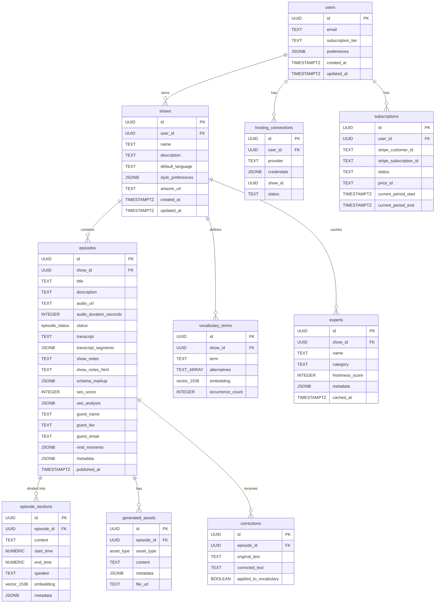

# Layer Report: Data Model

**Agent:** data-model
**Date:** 2026-02-24
**Project:** PodBrain

---

## Summary

PodBrain uses Supabase (PostgreSQL 15+) with the pgvector extension for semantic embedding storage. The schema is well-designed with proper normalization, HNSW vector indexes, and comprehensive RLS policies. The migration history reveals a schema that evolved through multiple phases, with one notable schema conflict between Phase 1 and Phase 7 migrations for the `hosting_connections` table that required an alignment migration to reconcile. The data model correctly supports the single-user MVP mode with clear pathways to multi-user auth.

---

## Database Schema

### Tables (8 core, 1 advanced-feature)

| Table | Purpose | Key Columns | Indexes |
|-------|---------|-------------|---------|
| `users` | User accounts (single-user mode) | id (UUID PK), email, subscription_tier, preferences JSONB | None needed (single row) |
| `shows` | Podcast series | id (UUID PK), user_id (FK), name, style_preferences JSONB | shows_user_id_idx |
| `episodes` | Individual podcast episodes | id (UUID PK), show_id (FK), status (enum), transcript, show_notes, seo_score, viral_moments JSONB | episodes_show_id_status_idx, episodes_show_id_created_at_idx |
| `episode_sections` | Semantic segments with embeddings | id (UUID PK), episode_id (FK), content, embedding vector(1536) | episode_sections_embedding_idx (HNSW), episode_sections_embedding_hnsw_idx (phase 6 duplicate) |
| `generated_assets` | AI-generated content per episode | id (UUID PK), episode_id (FK), asset_type (enum), content TEXT, metadata JSONB | generated_assets_episode_id_idx |
| `corrections` | User transcript corrections | id (UUID PK), episode_id (FK), original_text, corrected_text, applied_to_vocabulary | corrections_episode_id_idx |
| `vocabulary_terms` | Custom show vocabulary with embeddings | id (UUID PK), show_id (FK), term, alternatives TEXT[], embedding vector(1536), occurrence_count | vocabulary_terms_embedding_idx (HNSW), vocabulary_terms_show_id_idx |
| `hosting_connections` | Podcast hosting platform OAuth | id (UUID PK), user_id (FK), platform (enum), provider TEXT, credentials JSONB | hosting_connections_user_id_idx |
| `subscriptions` | Stripe subscription state | id (UUID PK), user_id (FK), stripe_subscription_id UNIQUE, status, price_id | idx_subscriptions_user_id, idx_subscriptions_stripe_subscription_id |
| `experts` | Cached expert discovery results | id (UUID PK), show_id (FK), name, category, freshness_score | experts_show_id_idx, experts_cached_at_idx, experts_category_idx |

### Enum Types

| Enum | Values |
|------|--------|
| `episode_status` | pending, processing, completed, failed |
| `asset_type` | show_notes, linkedin_post, twitter_thread, instagram_carousel, newsletter, blog_post, youtube_description, tiktok_hook, quote_card, audiogram + 30 additional added in phase 6 migration |
| `hosting_platform` | buzzsprout, transistor, podbean |

---

## Entity Relationships

---

## ORM / Query Patterns

The project uses the Supabase JS client directly (no ORM). Query patterns observed:

- **Row-level filtering**: All queries filter by `DEFAULT_USER_ID` via join on `shows.user_id` — correct for single-user mode, ready for multi-user via `auth.uid()` swap.
- **Pagination**: Consistent use of `.range(offset, offset + perPage - 1)` and `PAGINATION.defaultPageSize` constants.
- **Embedding queries**: pgvector similarity searches use cosine distance via `vector_cosine_ops` on HNSW indexes.
- **Admin client for privileged ops**: File uploads, vocabulary management, and Trigger.dev jobs use `createAdminClient()` (service role), correctly isolated from browser clients.
- **Select optimization**: Most queries select specific columns rather than `select('*')` (good practice), though some use `select('*')` (episodes list uses explicit column list).

---

## State Management

No client-side state management library (no Redux, Zustand, Jotai). State is managed via:

1. **Custom hooks** (`use-episodes.ts`, `use-episode.ts`, etc.) — fetch via the `/api/*` layer, local `useState` for results
2. **React state** within feature components for UI state (tabs, form values)
3. **localStorage** — theme preference and sidebar collapse state
4. **No global client cache** — no SWR, React Query, or similar. Each hook independently fetches and does not share cache with siblings.

---

## Vector/Embedding Architecture

Two embedding columns exist:
- `vocabulary_terms.embedding` — vector(1536) for semantic term matching
- `episode_sections.embedding` — vector(1536) for semantic episode content search

Both use HNSW indexes with `vector_cosine_ops`. The `cross-episode/similarity.ts` service performs cross-episode content similarity using these embeddings. The embedding dimension (1536) matches OpenAI `text-embedding-ada-002` / Grok embedding dimensions.

---

## Migration History Analysis

| Migration | Date | Purpose | Risk |
|-----------|------|---------|------|
| `0001_initial_schema.sql` | Initial | Core schema: users, shows, episodes, sections, assets, corrections, hosting_connections, vocabulary_terms | Low |
| `20260202_phase6_advanced_features.sql` | 2026-02-02 | Adds viral_moments, experts table, second HNSW index | Low |
| `20260202000000_phase7_integrations.sql` | 2026-02-02 | Adds subscriptions, recreates hosting_connections with different schema | High — schema conflict |
| `20260218000000_schema_alignment.sql` | 2026-02-18 | Expands asset_type enum (30 new values), reconciles hosting_connections conflict | Medium |

---

## Findings

**FINDING [HIGH] — hosting_connections schema conflict across migrations**
Phase 1 created `hosting_connections` with columns `platform` (enum), `access_token`, `refresh_token`. Phase 7 recreated the table with `provider` (TEXT), `credentials` (JSONB), `show_id`, `status`. The schema alignment migration adds the Phase 7 columns conditionally but does NOT drop the Phase 1 columns. The live table likely has both schemas simultaneously (`platform`, `access_token`, `refresh_token`, `provider`, `credentials`, `show_id`, `status`). API code uses Phase 7 columns (`provider`, `credentials`). The Phase 1 `hosting_platform` enum is referenced by the original `platform` column but the API ignores it. This creates schema drift and confusion.

**FINDING [HIGH] — No cache invalidation for custom hooks**
The 11 custom hooks use plain `fetch()` with no SWR or React Query. Data is fetched once on mount and not revalidated. If an episode is processed (status changes to `completed`), the episode list will not automatically refresh. The `use-polling.ts` hook exists but it's unclear how widely it's used to compensate.

**FINDING [MEDIUM] — Duplicate HNSW index on episode_sections.embedding**
Phase 1 creates `episode_sections_embedding_idx`, and Phase 6 creates `episode_sections_embedding_hnsw_idx` on the same column with the same operator class. Two HNSW indexes on one column wastes storage and marginally slows writes.

**FINDING [MEDIUM] — RLS policies for phase 1 tables allow ALL operations for ALL users**
The initial RLS policies use `USING (true)` — allowing any authenticated or anonymous user to read/write all rows. In production with real auth, this must be replaced with user-scoped policies (`USING (user_id = auth.uid())`). The `experts` table in phase 6 correctly uses `auth.uid()`, but all phase 1 tables do not.

**FINDING [MEDIUM] — asset_type enum has 40+ values, poorly documented split**
The initial `asset_type` enum had 10 values. Phase 6 migration added 30+ new values via individual `ALTER TYPE ... ADD VALUE` statements. The `constants.ts` file's `ASSET_TYPES` array still only has the original 10 values, creating a drift between the TypeScript source of truth and the database enum.

**FINDING [MEDIUM] — credentials stored as JSONB without column-level encryption**
`hosting_connections.credentials` stores Buzzsprout API tokens. While `lib/buzzsprout/encryption.ts` encrypts credentials before insertion, this is application-level encryption. The column is untyped JSONB, and the encryption key must be an environment variable (encryption is only as strong as key management).

**FINDING [LOW] — episodes.seo_score is an INTEGER (0-100) with CHECK constraint, but seo_analysis is JSONB with full analysis**
There is no column for the SEO analysis timestamp, so it's impossible to know when the SEO analysis was last run vs when the episode was last updated. A `seo_analyzed_at TIMESTAMPTZ` column would help.

**FINDING [LOW] — No soft deletes**
All tables use hard deletes. For a content platform, soft deletes (deleted_at TIMESTAMPTZ) on episodes and shows would prevent accidental data loss.

**FINDING [INFO] — Default user ID inserted twice across migrations**
Both `0001_initial_schema.sql` and `20260202000000_phase7_integrations.sql` insert the default user `00000000-0000-0000-0000-000000000001`. The phase 7 migration uses `ON CONFLICT (id) DO UPDATE` to handle this, but the initial migration does not.

---

## Findings Summary

| Severity | Count | Items |
|----------|-------|-------|
| Critical | 0 | — |
| High | 2 | hosting_connections schema conflict, No cache invalidation in hooks |
| Medium | 4 | Duplicate HNSW index, Permissive RLS policies, asset_type enum drift, Untyped credential storage |
| Low | 2 | Missing seo_analyzed_at, No soft deletes |
| Info | 1 | Duplicate default user insertion |
