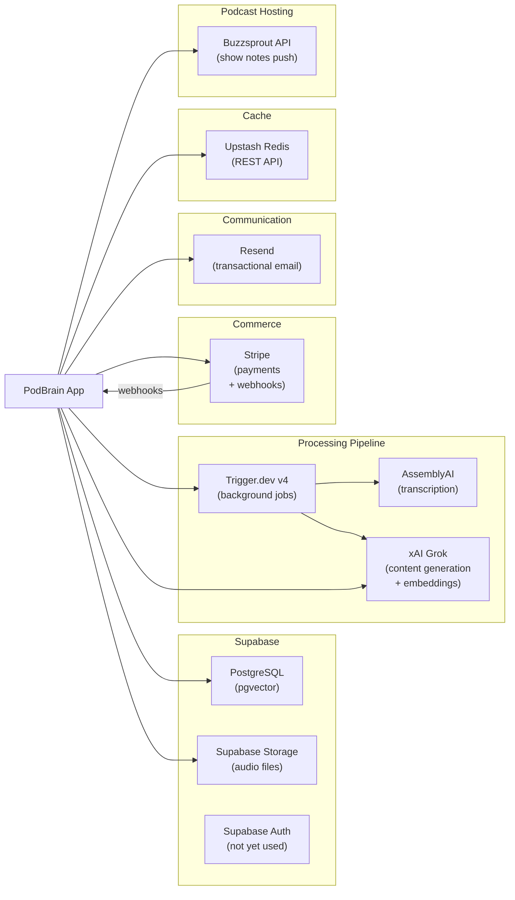

# Layer Report: Integration

**Agent:** integration
**Date:** 2026-02-24
**Project:** PodBrain

---

## Summary

PodBrain integrates with 7 external services: Supabase (database + storage), AssemblyAI (transcription), xAI Grok (content generation), Upstash Redis (cache + rate limiting), Stripe (payments), Resend (email), and Buzzsprout (podcast hosting). Each integration has a dedicated client library. Error handling at integration boundaries is inconsistent — email has retry logic with exponential backoff, Stripe webhook handling has 3-retry loops, and content generation has retry on 429, but many direct fetch() calls have no retry or timeout. Redis is gracefully optional (falls back to null client). The Buzzsprout integration correctly encrypts API credentials with AES-256-GCM.

---

## Integration Map

---

## Integration Detail

### Supabase (Database + Storage)

- **Client libraries:** `@supabase/ssr` 0.8.0, `@supabase/supabase-js` 2.93.3
- **Three clients:** Browser (anon key), Server SSR (anon key + cookie handling), Admin (service role key for elevated ops)
- **Connection pattern:** Client created per-request (no connection pooling at app layer — handled by Supabase's pgBouncer)
- **Storage bucket:** `episodes` — audio files uploaded via admin client
- **Signed URL TTL:** 24 hours — AssemblyAI has 24h window to fetch audio

**Error handling:** Supabase errors are checked via `{ error }` destructuring. Most routes return 500 on database errors. The `createAdminClient()` correctly uses the service role key and is never exposed to client-side code.

### AssemblyAI (Transcription)

- **Client:** `assemblyai` SDK 4.8.0
- **Configuration:** `speaker_labels: true`, `auto_highlights: true`, `word_boost: customVocabulary` (up to 1000 terms)
- **Error handling:** SDK handles polling internally. The client wraps errors and re-throws
- **Trigger.dev integration:** Transcription runs as a sub-task (`transcribeAudioTask`) within the main processing job, inheriting the 30-minute timeout

### xAI Grok (Content Generation)

- **Client:** Raw `fetch()` to `https://api.x.ai/v1` — no SDK
- **Model:** `grok-beta` (chat), `grok-embedding-small` (embeddings)
- **Retry:** 3 attempts with exponential backoff in `generator.ts`; no retry in direct `xai-client.ts` calls
- **Timeout:** No explicit timeout on fetch() calls
- **Response format:** `{ type: 'json_object' }` — enforces JSON output from model

### Upstash Redis (Cache + Rate Limiting)

- **Client:** `@upstash/redis` 1.34.0 (HTTP REST API)
- **Graceful degradation:** Redis client is `null` if env vars not set — `isRedisAvailable()` check available
- **Rate limiting implementation:** Sliding window using sorted sets (ZADD + ZCARD + ZREMRANGEBYSCORE)
- **Expert cache:** 7-day TTL on expert discovery results

**Issue:** While rate limiting is implemented, it is never called by API routes.

### Stripe (Payments)

- **Client:** `stripe` SDK 20.3.0
- **Webhook:** Raw buffer for signature validation (correct HMAC pattern)
- **Price IDs:** Resolved server-side from `STRIPE_PRO_PRICE_ID` and `STRIPE_AGENCY_PRICE_ID` env vars
- **Retry logic:** 3-attempt retry loops on subscription tier updates in webhook handlers
- **Events handled:** `checkout.session.completed`, `customer.subscription.updated`, `customer.subscription.deleted`

**Pricing discrepancy:** `constants.ts` defines Pro at `$19/mo`, 3 shows, 1 team seat. `stripe/products.ts` defines Pro at `$19`, 50 episodes/mo, 5 shows. These numbers disagree — the products.ts appears to have different limits than the constants.ts subscription tiers.

### Resend (Email)

- **Client:** `resend` SDK 6.9.1
- **Usage:** Guest package email only
- **Email validation:** RFC 5322-compliant regex with length check (254 chars max)
- **Retry:** `sendGuestPackageEmailWithRetry()` — 3 attempts, exponential backoff, skips retry on validation/config errors
- **Default from address:** Falls back to `onboarding@resend.dev` if `RESEND_FROM_EMAIL` not set — this is the Resend onboarding address, not a production sender

### Buzzsprout API

- **Client:** Custom `BuzzsproutClient` in `lib/buzzsprout/client.ts`
- **Credential storage:** API tokens encrypted with AES-256-GCM + PBKDF2 (100,000 iterations) before database storage
- **Encryption:** `lib/buzzsprout/encryption.ts` — well-implemented with entropy validation, versioned encryption format
- **Operations:** List podcasts, list episodes, push show notes

---

## Error Handling at Integration Boundaries

| Integration | Retry | Timeout | Circuit Breaker | Graceful Degradation |
|------------|-------|---------|-----------------|---------------------|
| Supabase DB | None (single attempt) | None | None | Returns empty data |
| Supabase Storage | None | None | None | Returns error |
| AssemblyAI | SDK internal | SDK internal | None | Job fails |
| xAI Grok (generator.ts) | 3x exponential | None | None | Returns `success: false` |
| xAI Grok (xai-client.ts) | None | None | None | Throws |
| Upstash Redis | None | None | None | Skips (optional) |
| Stripe | None (webhooks retry 3x on DB) | None | None | Throws |
| Resend | 3x exponential | None | None | Returns `{ success: false }` |
| Buzzsprout | None | None | None | Throws |
| Trigger.dev | 3x exponential (configured) | 30 min job max | None | Job status = failed |

---

## Findings

**FINDING [HIGH] — Pricing discrepancy between constants.ts and stripe/products.ts**
`constants.ts` SUBSCRIPTION_TIERS defines Pro as: unlimited episodes, 3 shows, 1 team seat. `stripe/products.ts` PRICING_TIERS defines Pro as: 50 episodes/month, 5 shows. These definitions disagree on both episode limits and show limits. One of these is the source of truth for subscription enforcement, but both are used in the UI. This could lead to over-provisioning or under-delivery of plan features.

**FINDING [HIGH] — No circuit breaker on external service calls**
No circuit breaker pattern is implemented for any external service. If xAI API becomes unavailable, every content generation request will attempt 3 retries (with delays), consuming serverless function time and potentially degrading the entire application. No fallback content or cached responses exist.

**FINDING [MEDIUM] — Resend default sender is `onboarding@resend.dev`**
`lib/email/service.ts` line 86: `fromEmail = process.env.RESEND_FROM_EMAIL || 'onboarding@resend.dev'`. If `RESEND_FROM_EMAIL` is not configured in production, guest package emails are sent from Resend's own onboarding address. This would appear unprofessional and could cause deliverability issues.

**FINDING [MEDIUM] — No timeout on any fetch() call to external APIs**
Direct `fetch()` calls in `xai-client.ts`, `buzzsprout/client.ts` (assumed), and others have no `signal: AbortSignal.timeout(N)` parameter. Next.js serverless functions have a 30-second maximum execution time. A hanging external API call will consume the entire serverless budget.

**FINDING [MEDIUM] — Audio signed URL expires in 24 hours but processing could theoretically retry later**
When an episode upload creates a 24-hour signed URL, it's stored in `episodes.audio_url`. Trigger.dev retries failed jobs with up to 3 attempts and up to 120s between retries. If a first attempt succeeds in storing the signed URL and later processing is retried after 24 hours (very unlikely but possible), the URL would be expired. A permanent public URL should be used for the audio reference.

**FINDING [LOW] — No webhook idempotency for Stripe events**
Stripe can deliver webhook events multiple times. The `handleCheckoutCompleted` uses `upsert` (idempotent), but `handleSubscriptionUpdated` uses `update` which could fail if the subscription record doesn't exist. Stripe recommends idempotency keys or checking `event.id` against a processed-events store.

**FINDING [LOW] — Kokonut drift check runs in CI against Swiss Broadcast UI**
The CI workflow runs `npm run check:kokonut-drift`. The Kokonut UI system was the previous design and has been replaced by Swiss Broadcast. Running a drift check for the old system is wasteful at best and could produce false alarms.

**FINDING [INFO] — Buzzsprout credential encryption is excellent**
AES-256-GCM, random salt + IV per encryption, PBKDF2 key derivation with 100,000 iterations, GCM authentication tag, entropy validation on the encryption key, and a versioned format. This is production-grade credential storage.

---

## Findings Summary

| Severity | Count | Items |
|----------|-------|-------|
| Critical | 0 | — |
| High | 2 | Pricing discrepancy between constants and products, No circuit breaker |
| Medium | 3 | Wrong default email sender, No fetch timeouts, Signed URL expiry risk |
| Low | 2 | Stripe webhook idempotency, Kokonut drift check in CI |
| Info | 1 | Buzzsprout credential encryption is production-grade |
