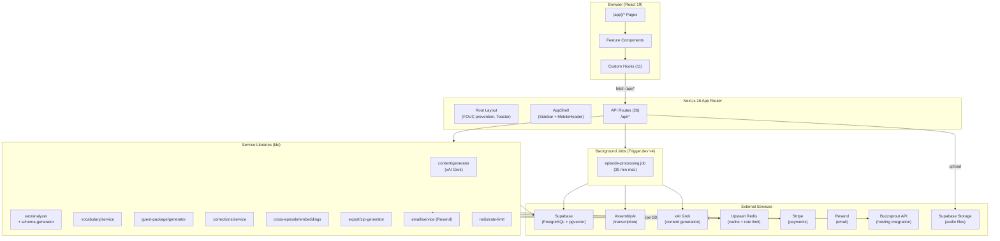

# Layer Report: Project Structure

**Agent:** project-structure
**Date:** 2026-02-24
**Project:** PodBrain — AI-powered podcast content platform

---

## Summary

PodBrain is a Next.js 16 App Router monorepo with a clear feature-based frontend layered over a service-oriented backend. The codebase is well-organized with strong separation between UI primitives, feature components, API routes, and service libraries. The architecture is a hybrid of a SaaS web application and a background-processing pipeline. The dominant pattern is a thin App Router shell (page.tsx files) delegating to fat feature components, which in turn consume custom hooks backed by REST API routes.

---

## Directory Tree (Top 3 Levels)

```
urban-octo-funicular/
├── app/                          # Next.js application root
│   ├── src/
│   │   ├── app/                  # App Router (pages + API)
│   │   │   ├── (app)/            # Route group — authenticated app shell
│   │   │   │   ├── episodes/     # Episode list + [id] workspace
│   │   │   │   ├── experts/      # AI expert discovery
│   │   │   │   ├── settings/     # Subscription + integrations
│   │   │   │   ├── support/      # Help center
│   │   │   │   ├── upload/       # 3-step upload wizard
│   │   │   │   ├── vocabulary/   # Custom vocab management
│   │   │   │   └── layout.tsx    # AppShell wrapper
│   │   │   ├── api/              # REST API routes (26 routes)
│   │   │   │   ├── episodes/     # Episode CRUD + sub-resources
│   │   │   │   ├── shows/        # Show CRUD + experts/related
│   │   │   │   ├── buzzsprout/   # Podcast hosting integration
│   │   │   │   ├── stripe/       # Payments (checkout/portal/webhooks)
│   │   │   │   ├── subscriptions/# Subscription state
│   │   │   │   ├── upload/       # File upload handler
│   │   │   │   └── seed/         # Dev seeding endpoint
│   │   │   ├── layout.tsx        # Root layout + FOUC prevention + Toaster
│   │   │   └── page.tsx          # Root redirect
│   │   ├── components/           # React component library
│   │   │   ├── ui/               # 16 primitive components
│   │   │   ├── layout/           # 6 structural components
│   │   │   ├── episodes/         # 11 episode-domain components
│   │   │   ├── upload/           # 3 upload-flow components
│   │   │   ├── vocabulary/       # 3 vocab components
│   │   │   ├── experts/          # 2 expert components
│   │   │   └── settings/         # 1 settings page component
│   │   ├── hooks/                # 11 custom React hooks
│   │   ├── lib/                  # Service libraries (40+ modules)
│   │   │   ├── assemblyai/       # Transcription client
│   │   │   ├── buzzsprout/       # Hosting platform client
│   │   │   ├── content/          # AI content generation
│   │   │   ├── corrections/      # Transcript correction service
│   │   │   ├── cross-episode/    # Embedding similarity
│   │   │   ├── email/            # Resend email service
│   │   │   ├── experts/          # Expert discovery logic
│   │   │   ├── export/           # ZIP export generator
│   │   │   ├── guest-intel/      # Guest intelligence service
│   │   │   ├── guest-package/    # Guest promo package generator
│   │   │   ├── redis/            # Cache + rate limiting
│   │   │   ├── seo/              # SEO analysis + schema gen
│   │   │   ├── stripe/           # Payments client
│   │   │   ├── supabase/         # DB clients (browser + server + admin)
│   │   │   ├── trigger/          # Background job client
│   │   │   ├── viral-moments/    # Viral content detector
│   │   │   └── vocabulary/       # Vocab management service
│   │   ├── trigger/              # Trigger.dev job definitions
│   │   │   └── jobs/             # Background processing jobs
│   │   └── types/                # TypeScript type definitions
│   ├── test/
│   │   ├── unit/                 # Unit tests (Vitest)
│   │   ├── integration/          # Integration tests (Vitest)
│   │   ├── e2e/                  # End-to-end tests (Playwright)
│   │   ├── setup/                # Test environment setup
│   │   └── utils/                # Test helpers
│   ├── public/                   # Static assets + PWA manifest
│   ├── next.config.ts
│   ├── trigger.config.ts
│   ├── vitest.config.ts
│   └── package.json
├── supabase/
│   ├── migrations/               # 4 SQL migration files
│   │   ├── 0001_initial_schema.sql
│   │   ├── 20260202000000_phase7_integrations.sql
│   │   ├── 20260202_phase6_advanced_features.sql
│   │   └── 20260218000000_schema_alignment.sql
│   └── config.toml
└── docs/
    ├── product/                  # PRD and product docs
    ├── kokonut/                  # Legacy design system docs
    └── testing/                  # Test strategy
```

---

## Architectural Pattern

**Primary pattern: Feature-based, layered SaaS architecture**

The architecture follows a three-tier pattern:

1. **Presentation tier** — Next.js App Router pages + React components (Swiss Broadcast design system). Pages are intentionally thin; all state and logic lives in feature components or custom hooks.

2. **API tier** — 26 Next.js Route Handlers under `/api/` providing a RESTful interface. Route handlers are thin — they validate, call service functions, and return responses. No business logic lives in route handlers.

3. **Service tier** — `app/src/lib/` contains domain-organized service modules. Each sub-domain (seo, content, vocabulary, guest-package, etc.) has its own directory with a clear public interface.

**Secondary pattern: Background pipeline**

A separate Trigger.dev v4 background-job system handles the heavy processing pipeline (transcription → vocabulary post-processing → AI generation). This decoupling is architecturally sound and correctly separates synchronous API concerns from long-running async work.

**Layout pattern:** The App Router uses a `(app)` route group with a shared `AppShell` layout (sidebar + mobile header + content area). This cleanly separates the unauthenticated root redirect from the application shell.

---

## Module Boundaries

| Boundary | Responsibility | Coupling |
|----------|----------------|---------|
| `components/ui/` | Design system primitives | Internal only — no API or lib imports |
| `components/layout/` | App chrome | Imports hooks (use-shows, use-subscription) |
| `components/episodes/` | Episode domain UI | Imports hooks + lib/utils |
| `hooks/` | Data fetching + state | Calls fetch() to `/api/*` |
| `app/api/` | HTTP interface | Imports lib/* services |
| `lib/` | Business logic + integrations | Imports supabase clients, external SDKs |
| `trigger/jobs/` | Background processing | Imports lib/* services |
| `supabase/migrations/` | Database schema | Pure SQL — no TS dependencies |

Boundary discipline is **good**. Components do not import directly from `lib/`; they go through hooks. Route handlers do not implement business logic inline. Service modules are domain-namespaced and do not cross-import.

One exception worth noting: `components/layout/sidebar.tsx` imports `useShows` and `useSubscription` hooks, which make API calls. This couples the app chrome to data-loading, though this is standard practice in SaaS sidebar patterns.

---

## Dependency Graph (Key Flows)

```
Browser → page.tsx → FeatureComponent → useHook → fetch(/api/...) → RouteHandler → lib/service → supabase/external SDK
Browser → page.tsx → FeatureComponent → useHook → fetch(/api/...) → RouteHandler → lib/content/generator → xai-client → xAI API
AudioUpload → /api/upload → Supabase Storage → Trigger.dev job → AssemblyAI → Grok → Supabase write
```

---

## Key Structural Observations

### Strengths

1. **Clean route group architecture.** The `(app)` route group correctly wraps all authenticated pages under a shared layout without polluting the URL structure.

2. **Single-user mode is properly isolated.** The `DEFAULT_USER_ID` constant and `validateAuth()` stub are centralized in `lib/auth.ts` and `lib/constants.ts`. When auth is added, there is a single swap point.

3. **Supabase client split (browser vs server vs admin).** Three separate client factories correctly handle client-side, server-side (SSR), and privileged operations. This prevents accidental service-role key exposure.

4. **Background jobs correctly separated.** Trigger.dev jobs live in `app/src/trigger/jobs/` rather than being inlined in API routes. The `maxDuration: 1800` seconds (30 min) correctly accommodates 4-hour audio processing.

5. **Test infrastructure is comprehensive.** Unit, integration, and e2e test suites with separate Vitest configs and Playwright for e2e. The test directory structure mirrors the source tree.

6. **No Pages Router remnants.** The project is fully committed to App Router. No `/pages` directory exists.

### Issues and Risks

**FINDING [MEDIUM] — No middleware.ts file**
There is no `app/src/middleware.ts`. For a production SaaS, middleware is typically where authentication checks, rate limiting, and CORS headers are applied globally. Currently, each API route must individually handle auth (currently a no-op via `validateAuth()`). When real auth is added, this will require touching all 26 route handlers rather than a single middleware file.

**FINDING [MEDIUM] — Dev/test routes exposed without environment guards**
Routes at `/api/seed`, `/api/test-db`, `/api/test-redis`, and `/api/test-guest-package` exist in the source tree. While `lib/api/dev-guard.ts` likely provides some protection, these routes should not exist in production builds. No conditional compilation or build-time exclusion is evident.

**FINDING [LOW] — Hardcoded episode count in Sidebar (count={12})**
`sidebar.tsx` line 99 has `count={12}` hardcoded for the Episodes nav item. This is a placeholder that was never wired to real data.

**FINDING [LOW] — Hardcoded usagePercent in Sidebar (82%)**
`sidebar.tsx` line 41-42 has `const usagePercent = 82` with a comment acknowledging it's a placeholder. Usage metering is not yet connected to real subscription data.

**FINDING [INFO] — No monorepo tooling despite monorepo structure**
The project has a monorepo layout (`app/`, `supabase/`, `docs/`, `trigger/` at root) but no `turbo.json`, `nx.json`, or `pnpm workspaces` config. The `app/` directory contains all npm dependencies. This works fine at current scale but may become difficult to maintain if the `trigger/` worker directory needs its own dependencies.

**FINDING [INFO] — Legacy Netlify build artifacts in tree**
`app/.netlify/` contains build artifacts (including `.env.local` copies). These should be in `.gitignore`. The presence of `app/.netlify/functions-internal/___netlify-server-handler/.env.local` is a potential secret-leakage risk if this directory is committed.

---

## Mermaid Flowchart — Project Structure



---

## Findings Summary

| Severity | Count | Items |
|----------|-------|-------|
| Critical | 0 | — |
| High | 0 | — |
| Medium | 2 | Missing middleware.ts, Dev routes in production build |
| Low | 2 | Hardcoded nav counts, Hardcoded usage percent |
| Info | 2 | No monorepo tooling, Netlify build artifacts in tree |

---

## Files Analyzed

- `/app/src/app/layout.tsx`
- `/app/src/app/(app)/layout.tsx`
- `/app/src/app/(app)/*/page.tsx` (8 pages)
- `/app/src/app/api/**/*.ts` (26 routes)
- `/app/src/components/**/*.tsx` (42 components)
- `/app/src/hooks/*.ts` (11 hooks)
- `/app/src/lib/**/*.ts` (40+ modules)
- `/app/src/lib/auth.ts`
- `/app/src/lib/constants.ts`
- `/app/package.json`
- `/app/next.config.ts`
- `/app/trigger.config.ts`
- `/supabase/migrations/0001_initial_schema.sql`
