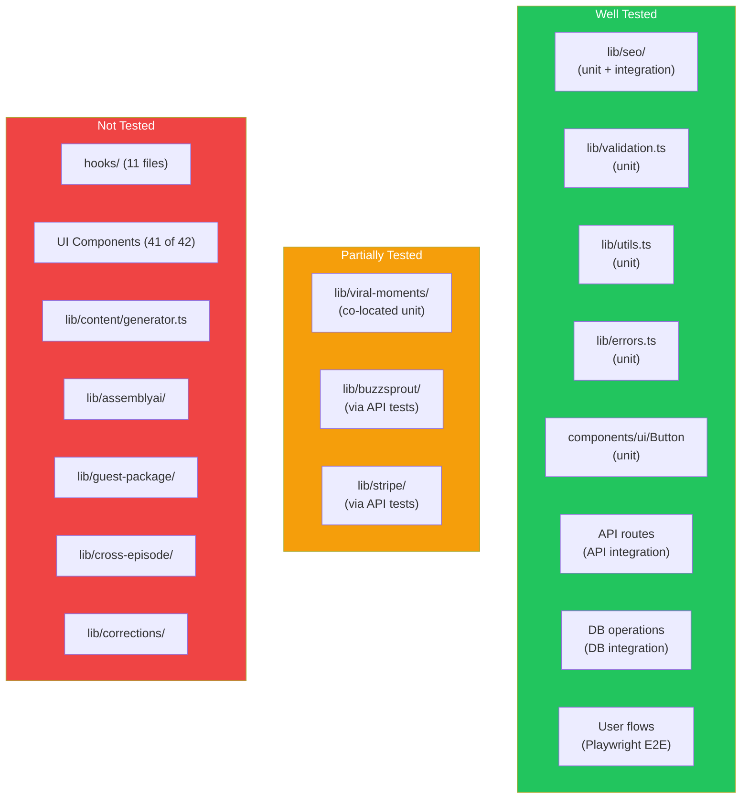

# Layer Report: Testing Quality

**Agent:** testing-quality
**Date:** 2026-02-24
**Project:** PodBrain

---

## Summary

PodBrain has a well-structured testing infrastructure with three distinct test suites (unit, integration, e2e) and four separate Vitest configuration files. The test investment is strong for a pre-launch MVP — the project has more test files than most early-stage SaaS products. However, the test suite has not been updated to match the latest UI rebuild on the `ui-rebuild-v3` branch, meaning component tests reference class names from the old design system. API integration tests require a running dev server. Coverage thresholds are not enforced.

---

## Test Suite Overview

### Test Infrastructure

| Tool | Version | Purpose |
|------|---------|---------|
| Vitest | ^3.1.3 | Unit + integration test runner |
| @testing-library/react | ^16.3.0 | Component testing |
| @testing-library/dom | ^10.4.0 | DOM queries |
| happy-dom | ^18.0.1 | DOM environment for component tests |
| Playwright | ^1.58.1 | E2E browser tests |
| @vitest/coverage-v8 | ^3.1.3 | Code coverage (V8) |

### Vitest Configuration Files

| Config | Scope | Test include pattern | Timeout |
|--------|-------|---------------------|---------|
| `vitest.config.ts` | All (default) | `test/**/*.test.{ts,tsx}`, `src/**/*.test.{ts,tsx}` | 30s |
| `vitest.unit.config.ts` | Unit only | `test/unit/**/*.test.{ts,tsx}` | 10s |
| `vitest.integration.config.ts` | DB integration | `test/integration/db/**/*.test.{ts,tsx}` | 30s |
| `vitest.api.config.ts` | API integration | `test/integration/api/**/*.test.{ts,tsx}` | 30s |

---

## Test File Inventory

### Unit Tests (7 files)

| File | Subject | Tests |
|------|---------|-------|
| `test/unit/lib/seo-analyzer.test.ts` | `lib/seo/analyzer.ts` | 20 tests — comprehensive coverage of SEO scoring, keyword density, header analysis, suggestions |
| `test/unit/lib/utils.test.ts` | `lib/utils.ts` | Utility function tests |
| `test/unit/lib/errors.test.ts` | `lib/errors.ts` | Error class tests |
| `test/unit/lib/schema-generator.test.ts` | `lib/seo/schema-generator.ts` | Schema markup generation tests |
| `test/unit/lib/constants.test.ts` | `lib/constants.ts` | Constants validation tests |
| `test/unit/lib/validation.test.ts` | `lib/validation.ts` | UUID, email, pagination validation tests |
| `test/unit/components/ui/button.test.tsx` | `Button` component | 20 tests — variants, sizes, interactions, accessibility |
| `test/unit/fixes/phase-a-data-flow.test.ts` | Data flow regression | Regression tests from Phase A fixes |
| `test/unit/fixes/phase-b-schema.test.ts` | Schema regression | Regression tests from Phase B fixes |
| `test/unit/fixes/phase-c-integrations.test.ts` | Integration regression | Regression tests from Phase C fixes |
| `test/unit/fixes/phase-d-security.test.ts` | Security regression | Regression tests from Phase D fixes |
| `src/lib/viral-moments/detector.test.ts` | Viral moment detector | Co-located test for viral moments detection |

### Integration Tests — DB (6 files)

| File | Subject |
|------|---------|
| `test/integration/db/shows.test.ts` | Shows CRUD via Supabase |
| `test/integration/db/episodes.test.ts` | Episodes CRUD via Supabase |
| `test/integration/db/vocabulary.test.ts` | Vocabulary terms CRUD |
| `test/integration/db/assets.test.ts` | Generated assets CRUD |
| `test/integration/db/redis-cache.test.ts` | Redis cache operations |
| `test/integration/db/schema-fixes.test.ts` | Schema alignment regression |

### Integration Tests — API (12 files)

| File | Subject |
|------|---------|
| `test/integration/api/episodes.test.ts` | GET /api/episodes |
| `test/integration/api/episodes-crud.test.ts` | Episodes CRUD endpoints |
| `test/integration/api/shows.test.ts` | Shows endpoints |
| `test/integration/api/assets-api.test.ts` | Assets endpoints |
| `test/integration/api/processing-api.test.ts` | Processing pipeline endpoints |
| `test/integration/api/upload-api.test.ts` | Upload endpoint |
| `test/integration/api/seo-api.test.ts` | SEO endpoints |
| `test/integration/api/guest-package-api.test.ts` | Guest package endpoints |
| `test/integration/api/buzzsprout-api.test.ts` | Buzzsprout integration |
| `test/integration/api/stripe-api.test.ts` | Stripe endpoints |
| `test/integration/api/subscriptions-api.test.ts` | Subscriptions endpoint |
| `test/integration/api/full-workflow.test.ts` | End-to-end workflow |
| `test/integration/api/data-flow-fixes.test.ts` | Data flow regression |

### E2E Tests — Playwright (7 files)

| File | Subject |
|------|---------|
| `test/e2e/flows/dashboard.spec.ts` | Dashboard/episodes list |
| `test/e2e/flows/upload-flow.spec.ts` | Audio upload wizard |
| `test/e2e/flows/episode-workflow.spec.ts` | Full episode processing workflow |
| `test/e2e/flows/show-management.spec.ts` | Show creation/management |
| `test/e2e/flows/vocabulary-management.spec.ts` | Vocabulary CRUD |
| `test/e2e/flows/settings-pages.spec.ts` | Settings and billing |
| `test/e2e/flows/marketing-pages.spec.ts` | Marketing/landing pages |

---

## Test-to-Code Ratio Analysis

| Module | Source Files | Test Files | Coverage |
|--------|-------------|-----------|---------|
| `lib/seo/` | 2 | 2 | Good |
| `lib/validation.ts` | 1 | 1 | Good |
| `lib/utils.ts` | 1 | 1 | Good |
| `lib/errors.ts` | 1 | 1 | Good |
| `lib/viral-moments/` | 3 | 1 (co-located) | Partial |
| `components/ui/button.tsx` | 1 | 1 | Good |
| Other UI components (41 files) | 41 | 0 | None |
| `lib/content/generator.ts` | 3 | 0 | None |
| `lib/assemblyai/` | 3 | 0 | None |
| `lib/buzzsprout/` | 4 | Via API tests | Indirect |
| `lib/stripe/` | 3 | Via API tests | Indirect |
| `lib/vocabulary/service.ts` | 2 | Via DB tests | Indirect |
| `hooks/` (11 files) | 11 | 0 | None |
| API routes (26 routes) | 26 | Via API tests | Indirect |

**Estimated overall unit test coverage: ~15-20% of source files directly tested**

---

## Test Infrastructure Quality

### Strengths

1. **Four-way test segregation**: Unit, DB integration, API integration, and E2E are cleanly separated with different configs and different concurrency models (unit runs threaded, integration runs in single fork for DB consistency).

2. **Test setup is thorough**: `test/setup/` contains `global-setup.ts`, `test-env.ts`, `database.ts`, `component-setup.ts`. The component setup configures `@testing-library/jest-dom` matchers.

3. **Cleanup strategy**: `test/setup/database.ts` provides `cleanupAllTestData()` and tests properly use `afterAll` to clean up test data prefixed with `[TEST]`.

4. **Playwright configuration is production-ready**: Traces on first retry, screenshots on failure, video on first retry, single worker for DB consistency.

5. **Co-located test for viral moments detector**: `src/lib/viral-moments/detector.test.ts` is co-located with the source, showing good instinct for test proximity.

6. **Regression test phase structure**: The `test/unit/fixes/phase-*.test.ts` files capture regression tests organized by fix phase — preventing regressions on resolved issues.

---

## Test Anti-Patterns Detected

**FINDING [HIGH] — Button component tests reference stale CSS class names**
`test/unit/components/ui/button.test.tsx` checks for class names like `bg-primary`, `bg-secondary`, `bg-destructive`, `hover:bg-accent`, `text-primary`. The Swiss Broadcast design system (ui-rebuild-v3 branch) uses CSS custom properties (`bg-[var(--color-accent-blue)]`, etc.) and the Button component was rebuilt. These tests will likely fail against the current `button.tsx` implementation — they test the old Kokonut/shadcn class names, not the new Swiss Broadcast component.

**FINDING [HIGH] — No coverage thresholds enforced**
`vitest.config.ts` configures coverage with `reporter: ['text', 'json', 'html']` but sets no `thresholds` (no minimum statement, branch, or function coverage). Coverage can drop to 0% without failing CI.

**FINDING [MEDIUM] — API integration tests require a manually-started dev server**
`test/integration/api/` tests use an `api-client.ts` that calls `http://localhost:3000`. These tests explicitly state "Start the server before running: npm run dev." This is fragile — CI pipelines must start the server as a prerequisite and tests will silently pass if the server is not running (network errors would cause test failures, not hangs).

**FINDING [MEDIUM] — No hook tests**
11 custom React hooks in `hooks/` are completely untested. Hooks like `use-episodes.ts`, `use-episode.ts`, `use-subscription.ts` contain data-fetching and business logic (polling, state management) that would benefit from mocked-fetch unit tests.

**FINDING [MEDIUM] — 41 UI components with only 1 tested (Button)**
Of 42 components across `ui/`, `layout/`, `episodes/`, `upload/`, `vocabulary/`, `experts/`, and `settings/`, only `Button` has a unit test. Components like `upload-wizard.tsx` (multi-step form), `episode-tabs.tsx` (tab management), and `show-notes-tab.tsx` contain significant logic that is untested.

**FINDING [MEDIUM] — E2E tests run against real database with no test isolation**
Playwright tests in `test/e2e/flows/` run against the real Supabase database (the dev server connects to real Supabase via `.env.local`). The global setup/teardown cleans up but if a test run is interrupted, test data may persist in the production database.

**FINDING [LOW] — vitest.config.ts includes src/**/*.test.{ts,tsx} but this catches only detector.test.ts**
The default config includes `src/**/*.test.{ts,tsx}` (co-located tests) but this pattern will also be picked up by the unit config's `test/unit/**` path. Running `npm test` could execute the co-located detector test twice across different test run invocations.

**FINDING [INFO] — Test data prefix convention is good**
All test data uses `[TEST]` prefix in names (e.g., `[TEST] Episode API Test Show`). The `cleanupAllTestData()` function deletes rows matching this prefix. This is a pragmatic approach for test isolation without a separate test database.

---

## Coverage Diagram

---

## Findings Summary

| Severity | Count | Items |
|----------|-------|-------|
| Critical | 0 | — |
| High | 2 | Stale button test class names, No coverage thresholds |
| Medium | 4 | Dev-server-dependent API tests, No hook tests, 41 untested components, E2E uses real DB |
| Low | 1 | Default config catches co-located tests redundantly |
| Info | 1 | [TEST] prefix convention is good practice |
