# Layer Report: UI/UX

**Agent:** ui-ux
**Date:** 2026-02-24
**Project:** PodBrain

---

## Summary

The "Swiss Broadcast" design system is sophisticated, well-executed, and internally consistent. The system uses Tailwind CSS v4's `@theme` directive to define CSS custom properties, yielding a design token system that is framework-agnostic and dark-mode-ready. Component hierarchy is clean with clear separation between primitive UI building blocks, layout chrome, and feature-domain components. Dark mode is correctly implemented with FOUC prevention. The primary accessibility gap is the absence of ARIA attributes on interactive elements that are not semantic HTML buttons or links.

---

## Design System Overview

### Design Tokens (globals.css)

The Swiss Broadcast system defines tokens via `@theme {}` in Tailwind CSS v4 syntax:

| Category | Tokens | Notes |
|----------|--------|-------|
| Surfaces | 6 colors | bg-base (#EDEAE5), bg-surface (#FAFAF8), bg-sidebar (#E4E0DA), bg-hover, bg-active, bg-overlay |
| Borders | 3 colors | border, border-strong, border-focus (#2563EB) |
| Text | 4 colors | ink (#1A1A1A), secondary, tertiary, on-accent |
| Accents | 6 colors | accent-blue (#2563EB), accent-warm (#C2693D), with hover and light variants |
| Status | 10 colors | success, error, processing, pending, warning — each with light variant |
| Shadows | 6 | card, card-hover, dropdown, focus, button, button-active |
| Typography | 3 font families | Space Grotesk (display), Source Serif 4 (body), JetBrains Mono (mono) |
| Type scale | 8 sizes | display (2rem) through label (0.6875rem) |
| Spacing | 10 values | 0.25rem through 4rem |
| Radii | 4 values | sm (4px), md (6px), lg (8px), full |
| Layout | 3 values | sidebar-width (240px), sidebar-collapsed (64px), content-max (1400px) |
| Transitions | 4 | fast (120ms), normal (200ms), slow (350ms) with named easings |

**Dark mode:** Implemented via `[data-theme="dark"]` attribute on `<html>`, toggling the full set of CSS custom properties. All light tokens have dark counterparts.

### Signature Details

1. **Blueprint grid background** — `body::before` applies a 24px dot-grid using CSS background-image (radial gradient + linear gradients). Professional and distinctive.

2. **Paper grain texture** — `body::after` applies an SVG-based fractalNoise filter at 2.5% opacity for tactile quality.

3. **Status indicator dots** — `.status-dot` utility class with `success`, `error`, `processing`, `pending`, `warning` variants. Processing dots animate with `pulse-dot` keyframe.

4. **Stagger animation system** — `.animate-enter` with `.stagger-1` through `.stagger-6` delays creates cascade entrance effects on episode list.

5. **`prefers-reduced-motion` support** — All CSS animations are disabled via media query. This is correctly implemented.

---

## Component Hierarchy

```mermaid
graph TD
    subgraph Primitives["UI Primitives (16 components)"]
        Button["Button\n(primary/secondary/ghost/warm/danger/link)"]
        Card["Card\n(surface wrapper)"]
        Badge["Badge\n(default/blue/success/warning/error/processing)"]
        Input["Input + Textarea"]
        Tabs["Tabs + TabList + TabTrigger + TabContent"]
        Skeleton["Skeleton\n(loading placeholder)"]
        EmptyState["EmptyState\n(icon + title + action)"]
        DropdownMenu["DropdownMenu\n(Radix UI based)"]
        Progress["Progress + CircularProgress"]
        ThemeToggle["ThemeToggle\n(light/dark, localStorage)"]
        SearchBar["SearchBar\n(with ⌘K shortcut hint)"]
        FilterPills["FilterPills\n(multi-option filter)"]
        UsageMeter["UsageMeter"]
        StatCard["StatCard"]
        ProcessingBanner["ProcessingBanner"]
        Sparkline["Sparkline"]
    end

    subgraph Layout["Layout Chrome (6 components)"]
        AppShell["AppShell\n(sidebar + content orchestrator)"]
        Sidebar["Sidebar\n(collapsible, 240px → 64px)"]
        MobileHeader["MobileHeader\n(hamburger + title)"]
        NavItem["NavItem\n(icon + label + count badge)"]
        ShowSelector["ShowSelector\n(current show switcher)"]
        PlanCard["PlanCard\n(tier + usage meter)"]
    end

    subgraph Episodes["Episode Domain (11 components)"]
        EpisodeList["EpisodeList\n(search + filter + list)"]
        EpisodeRow["EpisodeRow\n(link card with status/SEO)"]
        EpisodeTabs["EpisodeTabs\n(5-tab workspace)"]
        ShowNotesTab["ShowNotesTab"]
        AssetsTab["AssetsTab"]
        TranscriptTab["TranscriptTab"]
        GuestPackageTab["GuestPackageTab"]
        IntelligenceTab["IntelligenceTab"]
        EpisodeHeader["EpisodeHeader"]
        StatusDot["StatusDot"]
        SEOScore["SEOScore"]
        SignalChain["SignalChain"]
    end

    subgraph Upload["Upload Flow (3 components)"]
        UploadWizard["UploadWizard\n(3-step wizard)"]
        Dropzone["Dropzone\n(drag + drop)"]
        StepIndicator["StepIndicator"]
    end

    subgraph Others["Other Domains"]
        VocabPage["VocabularyPage"]
        VocabRow["VocabRow"]
        VocabBadge["VocabCategoryBadge"]
        ExpertsPage["ExpertsPage"]
        ExpertCard["ExpertCard"]
        SettingsPage["SettingsPage"]
    end

    AppShell --> Sidebar
    AppShell --> MobileHeader
    Sidebar --> NavItem
    Sidebar --> ShowSelector
    Sidebar --> PlanCard
    Sidebar --> ThemeToggle
    EpisodeList --> EpisodeRow
    EpisodeList --> SearchBar
    EpisodeList --> FilterPills
    EpisodeList --> Skeleton
    EpisodeList --> EmptyState
    EpisodeTabs --> ShowNotesTab
    EpisodeTabs --> AssetsTab
    EpisodeTabs --> TranscriptTab
    EpisodeTabs --> GuestPackageTab
    EpisodeTabs --> IntelligenceTab
    UploadWizard --> Dropzone
    UploadWizard --> StepIndicator
```

---

## Accessibility Assessment

### Strengths

1. **`prefers-reduced-motion` is respected** — All CSS animations have a `@media (prefers-reduced-motion: reduce)` override. This is correctly implemented.

2. **Focus visible ring** — `*:focus-visible` uses `box-shadow: var(--shadow-focus)` (3px blue ring) instead of removing the outline. This preserves keyboard navigation visibility.

3. **ThemeToggle has `aria-label`** — `aria-label={Switch to ${theme === "dark" ? "light" : "dark"} mode}` — correctly describes the action.

4. **Sidebar collapse button has `aria-label`** — The collapse/expand button in `sidebar.tsx` has `aria-label={collapsed ? "Expand sidebar" : "Collapse sidebar"}`.

5. **Semantic HTML**: `EpisodeRow` renders as an `<a>` (Link), not a `
`, so episode list items are properly keyboard-navigable and readable by screen readers.

### Issues

**FINDING [HIGH] — MoreHorizontal action button in EpisodeRow has no aria-label**
`episode-row.tsx` line 80-93: The actions button renders `<MoreHorizontal className="h-4 w-4" />` without any `aria-label` or text content. Screen readers would announce this as "button" with no description.

**FINDING [HIGH] — No episode title available on upload (field missing from wizard)**
`upload-wizard.tsx` does not have a `title` field in Step 1 or Step 2. The episode is created with no title, and it's unclear how the title is set. `EpisodeRow` falls back to `"Untitled Episode"` for episodes without titles.

**FINDING [MEDIUM] — Mobile overlay dismissal only via click on backdrop — no keyboard escape handling**
`AppShell` has `document.addEventListener("keydown", ...)` for Escape key to close mobile sidebar, but only when `mobileSidebarOpen` is true. This is correct, but the keyboard shortcut is not advertised or accessible to screen reader users who would not know to press Escape.

**FINDING [MEDIUM] — Sidebar NavItem count badges are hardcoded (count={12}, count={42})**
`sidebar.tsx` shows hardcoded counts for Episodes (12) and Vocabulary (42). These are not connected to real data. The UI misleads users about actual counts.

**FINDING [MEDIUM] — No `<label>` elements with proper `htmlFor` association in UploadWizard**
`upload-wizard.tsx` uses `<label>` elements but without `htmlFor` associating them to `<input>` elements by id. The inputs lack `id` attributes. This breaks screen reader association between labels and form fields.

**FINDING [MEDIUM] — Content style selector in Step 3 uses `<button>` instead of radio inputs**
`upload-wizard.tsx` renders content style options as custom-styled `<button>` elements instead of `<input type="radio">` with `<label>`. This means screen readers cannot communicate the selected/unselected state correctly (no `aria-pressed` or `role="radio"`).

**FINDING [LOW] — fonts loaded via Google Fonts CDN (render-blocking FOUT potential)**
`globals.css` imports Google Fonts via `@import url(...)`. This is a render-blocking request. The `display=swap` parameter is used, which prevents FOUT from blocking render, but there's no `<link rel="preconnect">` in the root layout for fonts.googleapis.com.

**FINDING [INFO] — Typography scale is editorial (excellent choice for podcast platform)**
Three typefaces with clear roles: Space Grotesk for headings/UI (modern, precise), Source Serif 4 for body text (editorial warmth), JetBrains Mono for metadata/labels (technical precision). The combination is distinctive and well-suited to a content platform.

---

## Responsive Design

- **Breakpoints**: Mobile-first, md (768px) breakpoint for sidebar visibility
- **Mobile sidebar**: Slide-out overlay via `fixed inset-y-0 left-0 z-50`, backdrop via `fixed inset-0 z-40`
- **Content max-width**: 1400px with `mx-auto` centering
- **EpisodeRow**: SEO score circle hidden on mobile (`hidden sm:flex`)
- **UploadWizard**: Content style grid is 2-column mobile, 4-column sm+
- **SearchBar + FilterPills**: Stack vertically on mobile, horizontal on sm+

---

## Findings Summary

| Severity | Count | Items |
|----------|-------|-------|
| Critical | 0 | — |
| High | 2 | Missing aria-label on MoreHorizontal button, No episode title field in upload wizard |
| Medium | 4 | Mobile overlay keyboard accessibility, Hardcoded nav counts, Missing htmlFor associations, Content style using buttons not radios |
| Low | 1 | Google Fonts without preconnect hint |
| Info | 1 | Typography scale is excellent for podcast platform |
