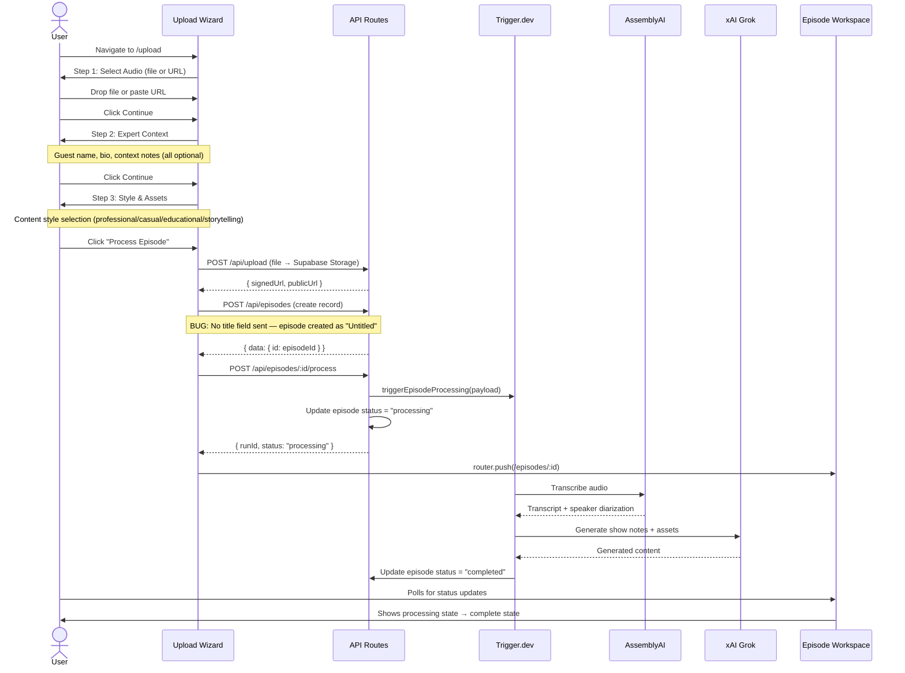

# Layer Report: User Flow

**Agent:** user-flow
**Date:** 2026-02-24
**Project:** PodBrain

---

## Summary

PodBrain has 6 primary user flows with clear entry points and defined end states. The core flow (upload → process → view results) is well-defined and linear. The upload wizard is the most critical UX path — it contains a bug where the episode `title` field is missing, causing all uploaded episodes to be untitled until post-processing (if ever). Most flows have appropriate empty states. No orphaned pages were detected, though the `/experts` page has weak connectivity to the rest of the app (no links to/from episodes). The episode workspace tab structure (5 tabs) is complete but tabs for unprocessed episodes show no progressive disclosure — all tabs are always visible.

---

## Route Map

| Route | Component | Entry Points | Exit Points |
|-------|-----------|-------------|------------|
| `/` | `page.tsx` | Direct navigation | Redirects to `/episodes` |
| `/episodes` | EpisodeList | Sidebar nav, root redirect | `/episodes/[id]`, `/upload` |
| `/episodes/[id]` | EpisodeHeader + EpisodeTabs | EpisodeRow click | Back to `/episodes`, `/upload` |
| `/upload` | UploadWizard | Sidebar "Upload" nav, EmptyState CTA | `/episodes/[id]` (after submit) |
| `/vocabulary` | VocabularyPage | Sidebar nav | — |
| `/experts` | ExpertsPage | Sidebar nav | — |
| `/settings` | SettingsPage | Sidebar nav | Stripe portal (external) |
| `/support` | Support page | Sidebar nav | — |

---

## Primary User Flow: Upload → Process → View



---

## User Flow: Episode Workspace (5 Tabs)

The episode detail page at `/episodes/[id]` presents 5 tabs:

| Tab | Content | Available When |
|-----|---------|---------------|
| Show Notes | Generated markdown + HTML | Episode completed |
| Assets | 30+ generated content assets | Episode completed |
| Transcript | Full transcript with speaker labels | Episode completed |
| Guest Package | Guest promo kit | Episode with guest info |
| Intelligence | SEO score, viral moments, related episodes | Episode completed |

**Gap:** All 5 tabs are rendered regardless of episode status. When an episode is in `pending` or `processing` state, all tabs display empty or placeholder content. There is no progressive disclosure or tab disabling for unavailable content.

---

## User Flow: Vocabulary Management

```
/vocabulary
├── View all vocabulary terms (sorted by occurrence_count desc)
├── Add new term (modal/form)
├── Edit term alternatives
├── Delete term
└── Merge duplicate terms
```

This flow is self-contained. Vocabulary terms connect to transcription quality but there is no UX feedback loop showing "this term improved transcription X times."

---

## User Flow: Expert Discovery

```
/experts
├── Enter topic/niche (search input)
├── AI discovery via Grok (cached 7 days in experts table)
├── View expert cards with freshness score
│   ├── Fresh (< 5 appearances)
│   ├── Established (5-20 appearances)
│   └── Oversaturated (> 20 appearances)
└── [Dead end — no action from expert card to episode or booking]
```

**Gap:** Expert cards display name, expertise, freshness score, and contact hints (website, Twitter, LinkedIn). However, there is no action to "save to episode" or "add to show's guest pipeline." Experts are discovery-only with no connection to the episode workflow.

---

## Error States Analysis

| Flow | Empty State | Error State | Loading State |
|------|------------|-------------|--------------|
| Episode list | EmptyState with Upload CTA | Not shown (just empty) | Skeleton rows |
| Episode workspace (pending) | Tab content shows nothing | Not shown | No skeleton |
| Upload submission failure | `setIsSubmitting(false)` — silent | No error message shown to user | Button shows "Processing…" |
| Vocabulary (empty) | Unknown | Unknown | Unknown |
| Experts (empty) | Unknown | Unknown | Unknown |

---

## Findings

**FINDING [HIGH] — Upload wizard creates episode with no title field**
`upload-wizard.tsx` `handleSubmit()` sends `audio_url`, `guest_name`, `guest_bio`, and `metadata` to `POST /api/episodes`, but no `title` field. The episode `title` is `NOT NULL` in the database schema, so either: (a) the API route provides a default title, or (b) the request fails silently. `EpisodeRow` falls back to `"Untitled Episode"`. There is no step in the wizard where the user names their episode. Users would need to edit the title after upload, but there is no obvious mechanism for this in the UI.

**FINDING [HIGH] — Upload error handling is silent — no user feedback on failure**
`upload-wizard.tsx` `handleSubmit()` catch block only calls `setIsSubmitting(false)`. If any API call fails (upload, episode creation, or process trigger), the button returns to "Process Episode" with no toast, error message, or indication of what went wrong.

**FINDING [MEDIUM] — Episode workspace shows all 5 tabs for unprocessed episodes**
When an episode is in `pending` or `processing` state, all 5 tabs (Show Notes, Assets, Transcript, Guest Package, Intelligence) are visible but empty. A better pattern would be to show only the processing state with a progress indicator, then reveal tabs progressively as content is generated.

**FINDING [MEDIUM] — Experts page is a dead end — no connection to episode workflow**
The `/experts` page discovers AI-generated expert suggestions but provides no action to book, tag, or associate an expert with a show or upcoming episode. Users have no clear next action after viewing expert cards.

**FINDING [MEDIUM] — No episode editing flow**
Once an episode is created, there is no obvious mechanism to edit its metadata (title, description, guest info) from the episode workspace. The `PUT /api/episodes/[id]` route exists, but no edit form is surfaced in the UI.

**FINDING [LOW] — Root page redirect may cause flash**
`/` renders a page.tsx that likely immediately redirects to `/episodes`. If this is a client-side redirect (router.push) there could be a brief flash of unstyled content. A server-side redirect in the page's `generateMetadata` or using `redirect()` from `next/navigation` would be cleaner.

**FINDING [LOW] — No breadcrumb or back navigation in episode workspace**
`/episodes/[id]` does not provide a visible breadcrumb or back button in the page header. Users must use the browser back button or click "Episodes" in the sidebar nav.

**FINDING [INFO] — Upload wizard correctly handles file + URL tabs as alternative inputs**
The toggle between file upload and URL import via Tabs component is a clean UX pattern for audio sourcing. Both input modes are validated before allowing navigation to Step 2.

---

## Findings Summary

| Severity | Count | Items |
|----------|-------|-------|
| Critical | 0 | — |
| High | 2 | Missing title field in upload wizard, Silent error handling |
| Medium | 3 | All tabs visible for unprocessed episodes, Experts dead end, No episode editing flow |
| Low | 2 | Root redirect flash, No breadcrumb in episode workspace |
| Info | 1 | Upload file/URL tab toggle is a clean UX pattern |
